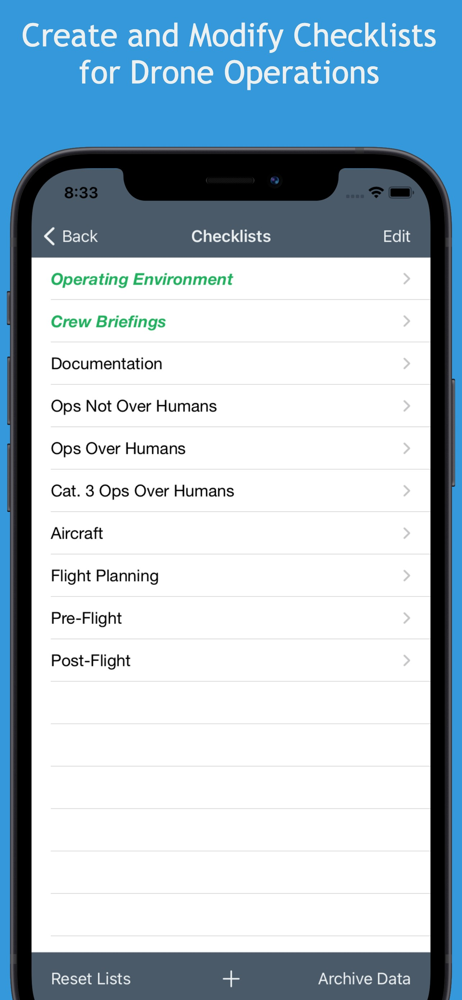
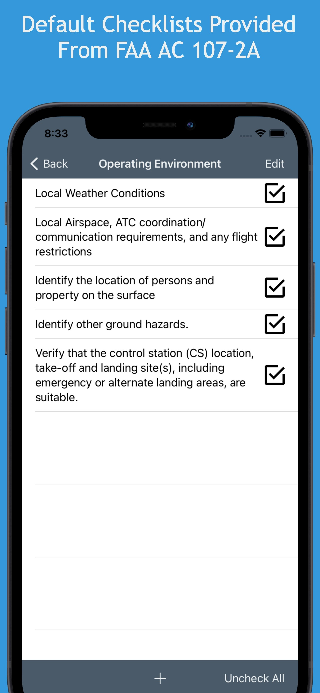
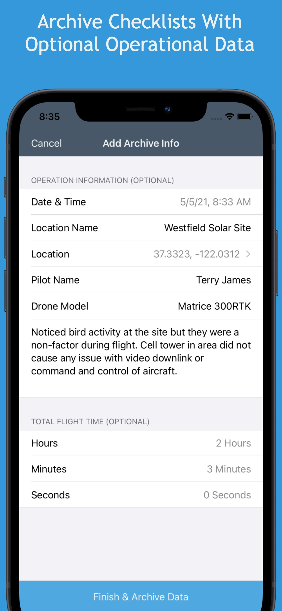
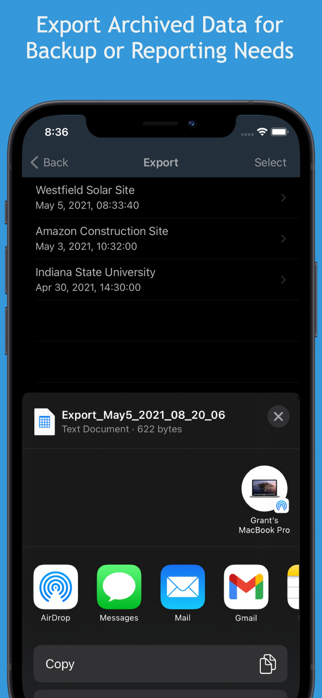

# Drone Checklist
Open source code for an app on the App Store called Drone Checklist. An app for drone pilots to complete checklists, save records, and export data. 

**Features:**

- Default checklists are provided based on the FAA’s sample preflight assessment and inspection checklist from FAA Advisory Circular 107-2A. The AC states “Remote pilots may choose to use this checklist or develop their own for the operation of their specific small UAS.“ and that is exactly what Drone Checklist enables. 
- Customize checklists to fit specific workflows by editing checklist categories, items, and order.
- Archive completed checklists with additional operational data so you have a saved record of completing the checklist and can use the checklist(s) again.
- Export archived data to a .csv file for modification, data backup, or reporting needs.

**App Screenshots**

   

**Key Code Implementations:**
- Storage or data with Local Database Realm
- Table Views (edit, add, remove data)
- Activity View Controller (export data to .csv)
- Design across iPhone and iPad
- Implementation of 3rd Party libraries

**Links:**

Drone Checklist in the App Store: (https://apps.apple.com/gb/app/drone-checklist-for-uas-uav/id1563866102)

[3rd party library Eureka for form design](https://github.com/xmartlabs/Eureka)

[Realm was used as a mobile database](https://docs.mongodb.com/realm/sdk/ios/)

Icons made by freepik, and Pixel perfect from [FlatIcon](www.flaticon.com). Additional icons made by Google.

**Feel free to contribute!**
